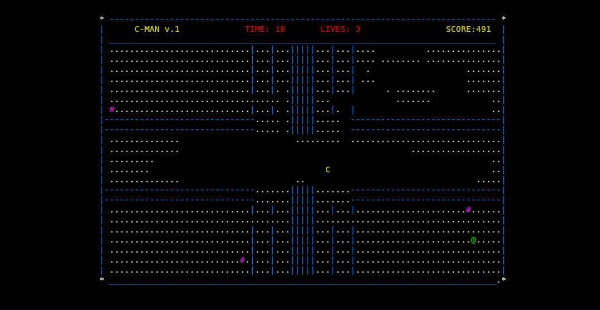
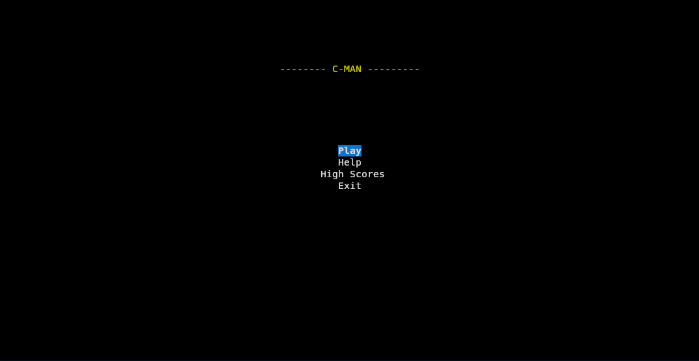

# **C-MAN**

A Pac-Man-inspired game, written in C using the Ncurses library.

---

## **Demo**
  
  

---

## **Features**
- Classic Pac-Man-inspired gameplay  
- Power-up orbs  
- Ghost enemies with dynamic movement  
- Scoring and timer mechanics  

---

To run the game, ensure you have the following installed:  
- **`gcc`** (GNU Compiler Collection)  
- **`make`**  
- **`ncurses` library**  

### **Install Ncurses**
#### On Ubuntu/Debian:
```bash
sudo apt-get install libncurses5-dev libncursesw5-dev
```
#### On MacOS:
```bash
brew install ncurses
```
## **Run Locally**
  1. Clone the repository:
   ```bash
   git clone https://github.com/bobbyskywalker/pacmangame
   cd pacmangame
```
  2. Build the executable:
  ```
    make
```
  3. Run the game:
  ```
  ./cmangame